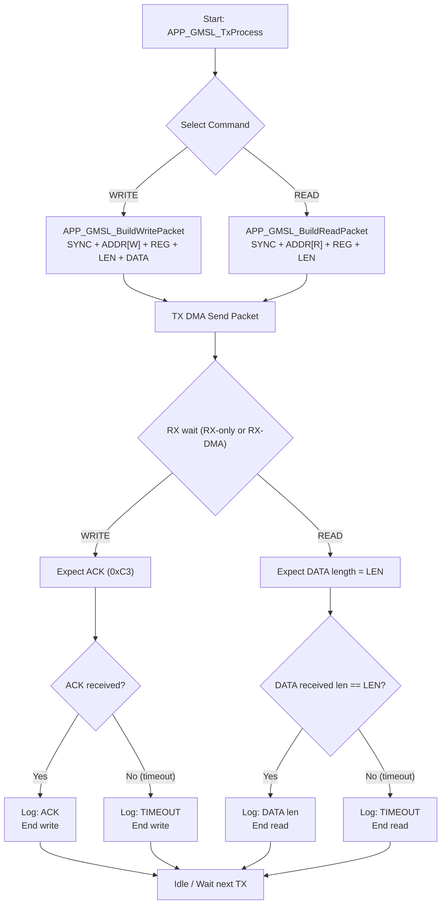
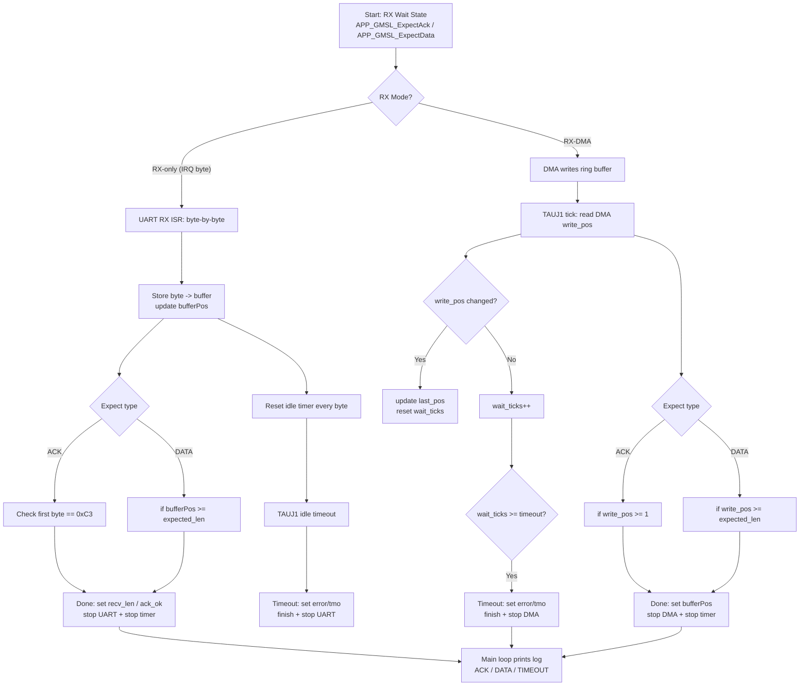

# Sample_Project_RH850_S1_UART_TX_DMA_RX_interrupt
Sample_Project_RH850_S1_UART_TX_DMA_RX_interrupt

update @ 2026/02/04

1. base on EVM : Y-BLDC-SK-RH850F1KM-S1-V2 (R7F701684/LQFP100/1MB flash) , initial below function

	- project MCU change to R7F7016923 (LQFP64/512K flash)

	- TAUJ0_0 : timer interval for 1ms interrupt

	- UART1 : RLIN31 (TX > P10_12 , RX > P10_11) , for printf and receive from keyboard

	- TAUJ1_0 : timer interval for XXX us interrupt , to detect UART1 RX idle bytes
	
		- baud rate 115200 : 217us

		- baud rate 415000 : 60.24us

	- UART0 : RLIN30 (TX > P10_10 , RX > P10_09)

        - TX DMA

        - RD with regular interrupt , by using timer irq , for idle detection 
		check below define in app_uart0_config.h
		
```c
/* UART0 RX mode select: 1 = DMA RX, 0 = interrupt RX-only */
#define APP_UART0_RX_MODE_DMA       (1U)
```		

		- modify cstart.asm , to increase stack size
		
```c
;-----------------------------------------------------------------------------
;	system stack
;-----------------------------------------------------------------------------
STACKSIZE	.set	0x1000
	.section	".stack.bss", bss
	.align	4
	.ds	(STACKSIZE)
	.align	4
_stacktop:
```

2. before use DMA , need to know

	- need to set __PEG__ register , before DMA to access SRAM normally

	- need to enable PEGSP register, PEGGnMK register, PEGGnBA register , PDMAnDMyiCM register 


about __PEGSP__ register 


about __PEGGnMK__ register 


about __PDMAnDMyiCM__ register 


about __PEGGnBA__ register 


 

```c
    PDMA0.DM00CM = _DMAC_PE1_SETTING | _DMAC_SPID0_SETTING | _DMAC_SUPERVISON_MODE;    
    PDMA0.DM01CM = _DMAC_PE1_SETTING | _DMAC_SPID0_SETTING | _DMAC_SUPERVISON_MODE;
    PEG.SP.UINT32 = 0x00000001U;                /* SPEN = 1, permit access */
    PEG.G0MK.UINT32 = 0xFFFFF000U;              /* 32KB window mask */
    PEG.G0BA.UINT32 = ADDR_LOCAL_RAM_CPU1 |     /* Base address of PE Guard protection Area (start of Local RAM) */
                    (0x1U<<7U) |                /* Enable Access for SPID 3 */
                    (0x1U<<6U) |                /* Enable Access for SPID 2 */
                    (0x1U<<5U) |                /* Enable Access for SPID 1 */
                    (0x1U<<4U) |                /* Enable Access for SPID 0 */
                    (0x1U<<2U) |                /* Write access is enabled */
                    (0x1U<<1U) |                /* Read access is enabled */
                    (0x1U<<0U);                 /* Settings for access enable conditions are enabled */

```

```c
/* LOCAL_RAM_CPU1 start address (PEG) */
#define ADDR_LOCAL_RAM_CPU1         (0xFEBF0000)
```

3. SRAM setting 

memory map (RH850/F1KM-S1)


| FLASH  | LOCAL RAM(CPU1) | RETENTION RAM(CPU1) |LOCAL RAM(SELF) | RETENTION RAM(SELF) |
|--------|----------------|--------------------|---------------|--------------------|
| 512K   | __0xFEBF0000__ ~ 0xFEBF7FFF | 0xFEBF8000 ~ 0xFEBFFFFF | __0xFEDF0000__ ~ 0xFEDF7FFF| 0xFEDF8000 ~ 0xFEDFFFFF|
| 768K   | __0xFEBE8000__ ~ 0xFEBF7FFF | 0xFEBF8000 ~ 0xFEBFFFFF | __0xFEDE8000__ ~ 0xFEDF7FFF| 0xFEDF8000 ~ 0xFEDFFFFF|
| 1MB    | __0xFEBE0000__ ~ 0xFEBF7FFF | 0xFEBF8000 ~ 0xFEBFFFFF | __0xFEDE0000__ ~ 0xFEDF7FFF| 0xFEDF8000 ~ 0xFEDFFFFF|


CPU1 area vs Self area


DMA access area


need to allocate SRAM section : dma_buff `0xFEBF0000` (FLASH : 512K)


define TX , RX DMA ram buffer in dma_buf section

```c
#pragma section dma_buf
volatile uint8_t s_uart0_dma_rx_ring[APP_UART0_DMA_RX_RING_SIZE];
volatile uint8_t s_uart0_dma_tx_buf[APP_UART0_DMA_TX_BUF_SIZE];
#pragma section default
```

the DMA ram buffer allocation result in map file


UART DMA TX , RX CONFIG 

| Item | DMA source address | DMA source address count direction |DMA dest. address|DMA dest. address count direction|
|------|--------------------|------------------------------------|-----------------|---------------------------------|
| TX |s_uart0_dma_tx_buf|increase|APP_UART0_TX_DR |fix|
| RX |APP_UART0_RX_DR |fix|s_uart0_dma_rx_ring|increase|


4. DMA address 


5. UART address


TX : RLN3nLUTDR

RX : RLN3nLURDR


6. Smart config setting

target trigger source : UART0

INTRLIN30UR0 : RLIN30 transmit interrupt 

INTRLIN30UR1 : RLIN30 receive complete interrupt 


TX : 

src : set in code (s_uart0_dma_tx_buf)

dest : set in code (APP_UART0_TX_DR)

src count : increase

dest count : fixed


RX : 

src : set in code (APP_UART0_RX_DR)

dest : set in code (s_uart0_dma_rx_buf)

src count : fixed

dest count : increase


7. due to UART function have no idle interrupt , need to use timer for idle detection (target : 2.5 bytes)

```
        for uart rx idle timer isr : 
        8N1 , 1 byte = 10 bits
        target : 2.5 bytes = 25 bits
        target_isr_timing
        - baud rate 115200 = (25 / 115200)*10^6 = 217.0us
        - baud rate 415000 = (25 / 415000)*10^6 = 60.24us
        
        timer_freq ​= PCLK(80MHz) /prescaler (1)
        CDR0 = (timer_freq * target_isr_timing/10^6) - 1
        - baud rate 115200 217.0us = (80MHz * 217us/10^6) - 1 = 80 * 217 - 1 = 0x43CF
        - baud rate 415000 60.24us = (80MHz * 60.24us/10^6) - 1 = 80 * 60.24 - 1 = 0x12D3    
```

```c
// #define APP_UART0_BAUD              (415000U)
#define APP_UART0_BAUD              (115200U)


#if (APP_UART0_BAUD == 115200U)
    TAUJ1.CDR0 = 0x43CFU;   /* 217 us = 2.5 bytes @115200 */
#elif (APP_UART0_BAUD == 415000U)
    TAUJ1.CDR0 = 0x12D3U;   /* 60.24 us = 2.5 bytes @415000 */
#else
    #error "Unsupported APP_UART0_BAUD"
#endif
```

8. if need to check global variable / array in watch windows , need to modify

enable [Access during the execution] at Debugger Property > Debug Tool Settings tab


9. use another MCU to emulate GMSL device , and below is communication protocol

MCU send WRITE packet to GMSL
```c
/* GMSL UART Base Mode WRITE packet format (MCU -> GMSL):
 * [0] SYNC        = 0x79
 * [1] DEV_ADDR_RW = (dev_addr << 1) | 0
 * [2] REG_ADDR
 * [3] LEN         = N (1..255, 256 => 0x00)
 * [4..] DATA[0..N-1]
 *
 * Response (GMSL -> MCU): ACK 0xC3 only.
 */
```

MCU send READ packet to GMSL
```c

/* GMSL UART Base Mode READ request format (MCU -> GMSL):
 * [0] SYNC        = 0x79
 * [1] DEV_ADDR_RW = (dev_addr << 1) | 1
 * [2] REG_ADDR
 * [3] LEN         = N (1..255, 256 => 0x00)
 *
 * Response (GMSL -> MCU): DATA[0..N-1] only (no ACK).
 */
```

Below is WRITE/READ packet designflow


Below is RX‑only vs RX‑DMA detail difference



10. below is log message :

log : when __WRITE__ tx data ( 8 bytes )


log : when __WRITE__ tx data ( 16 bytes )


log : when __WRITE__ tx data ( 32 bytes )


log : when __WRITE__ tx data ( 48 bytes )


log : when __WRITE__ tx data ( 64 bytes )


log : when __WRITE__ tx data ( 128 bytes )


log : when __READ__ tx data ( 8 bytes )


log : when __READ__ tx data ( 8 bytes )


log : when __READ__ tx data ( 16 bytes )


log : when __READ__ tx data ( 24 bytes )


log : when __READ__ tx data ( 32 bytes )


log : when __READ__ tx data ( 48 bytes )


log : when __READ__ tx data ( 64 bytes )


log : when __READ__ tx data ( 128 bytes )


